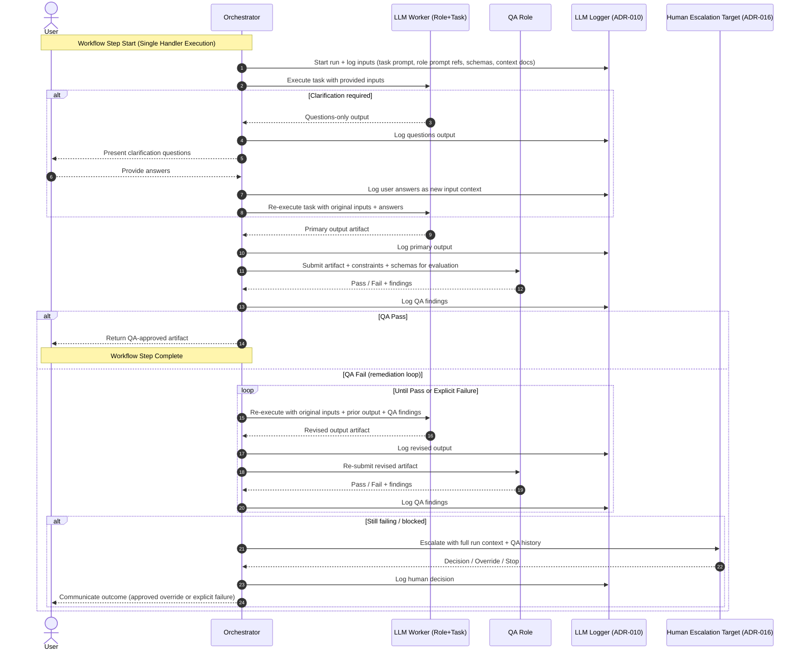

# ADR-024 — Clarification Question Protocol & Usability Constraints

**Status:** Accepted  
**Date:** 2026-01-02  
**Decision Type:** Architectural / Interaction Governance  
**Supersedes:** None  
**Related ADRs:**

- ADR-012 — Interaction Model
- ADR-016 — Escalation Targets & Human-in-the-Loop Design
- ADR-017 — Prompt Certification & Trust Levels

---

## 1. Context

The Combine explicitly treats questions as first-class outputs within its interaction model.  
Clarification questions are not conversational niceties; they are risk-containment mechanisms that prevent implicit assumptions, hallucinated intent, and unsafe inference.

However, unrestricted questioning creates usability risk:

- Excessive or poorly scoped questions stall progress
- Over-verbose questioning degrades trust
- Ambiguous questions reintroduce uncertainty instead of resolving it
- Question drift turns execution into discovery loops

To balance risk mitigation with human usability, The Combine requires a governed protocol for when, how, and how many clarification questions may be asked.

This ADR formalizes that protocol.

---

## 2. Decision

The Combine SHALL enforce a Clarification Question Protocol with explicit usability constraints.

Clarification questions are:

- Allowed only at defined interaction phases
- Bounded in number
- Required to be explicit, atomic, and decision-oriented
- Prohibited from embedding assumptions or recommendations
- Governed separately from the core Interaction Model, while referencing ADR-012

---

## 3. Scope

This ADR governs:

- When clarification questions may be produced
- What form they must take
- How they are presented to users
- How they interact with QA and escalation paths

This ADR does not define:

- Prompt wording for specific domains
- Discovery strategies (handled by task prompts)
- QA evaluation criteria (handled by QA role prompts)

---

## 4. Positioning Relative to ADR-012 (Interaction Model)

Clarification questioning is a sub-protocol, not the interaction model itself.

- ADR-012 defines the closed-loop execution flow
- ADR-024 defines the rules governing the Clarification Gate inside that flow

ADR-012 remains the canonical execution loop.  
ADR-024 constrains one specific phase of that loop.

### Interaction Flow (Reference)

---

## 5. Clarification Gate Rules (Normative)

> **Canonical Schema:** `seed/schemas/clarification_question_set.v1.json`  
> This schema mechanically enforces the constraints defined in this section.
>
> **Mandatory Usage:** All task prompts that produce clarification questions MUST output conformant JSON.  
> Non-conformant output is a validation failure.
>
> **Key schema fields:**
> - `question_set_kind`: Categorizes purpose (discovery, epic_backlog, architecture, etc.)
> - `must_answer_before_proceeding_ids`: Hard-blocks orchestrator on specified question IDs
> - `qa`: Self-reported compliance metrics (must all be zero/true)

### 5.1 When Questions Are Permitted

Clarification questions MAY be produced only when:

- Required input is missing
- Constraints are ambiguous or conflicting
- Multiple interpretations materially change the output
- Safety, governance, or compliance risk cannot be evaluated

Clarification questions MUST NOT be produced:

- After primary output generation
- During QA evaluation
- As a substitute for uncertainty acknowledgment
- To defer difficult decisions back to the user unnecessarily

### 5.2 Question-Only Mode (Hard Requirement)

When the Clarification Gate is entered:

- Output MUST contain only questions
- No analysis, commentary, or partial solutions are permitted
- No mixed outputs are allowed

This ensures:

- Determinism
- Auditability
- Clear separation between discovery and execution

### 5.3 Question Count Constraints

Unless overridden by a certified task prompt:

- **Maximum questions per Clarification Gate:** 5
- **Preferred range:** 2–4
- Single-question output is allowed but discouraged unless sufficient

If more than 5 questions appear necessary:

- The system MUST escalate per ADR-016
- Or explicitly fail with "insufficient clarity to proceed safely"

### 5.4 Question Quality Constraints

Every clarification question MUST:

- End with a ?
- Be answerable independently
- Resolve a specific decision point
- Avoid compound structures ("and/or" questions)
- Avoid presuppositions

Questions MUST NOT:

- Suggest an answer
- Encode a recommendation
- Contain phrases such as:
  - "Given that…"
  - "We should…"
  - "This implies…"
  - "Would you agree that…"
- Rephrase the same uncertainty multiple ways

---

## 6. Usability Constraints (Critical)

Clarification questions MUST be:

- **Concrete** — tied to a specific decision
- **Minimal** — only what is required to proceed
- **Ordered** — highest-impact questions first
- **Understandable** — no internal system jargon unless unavoidable

**The Combine prioritizes reducing user cognitive load without reintroducing risk.**

---

## 7. Determinism & Replayability

Clarification behavior MUST be:

- Deterministic given identical inputs
- Replayable without external context
- Fully loggable per ADR-010

Each Clarification Gate execution MUST include:

- Correlation ID
- Question list
- User responses
- Resolution timestamp

---

## 8. Interaction with QA

- QA MUST NOT generate clarification questions
- QA MAY flag:
  - Missing clarifications
  - Invalid question construction
  - Over-questioning
- QA MAY reject outputs produced without required clarification

**Clarification is a pre-QA activity, not a QA responsibility.**

---

## 9. Failure & Escalation

If clarification cannot safely resolve ambiguity:

The system MUST:

- Explicitly fail, OR
- Escalate to a human decision-maker per ADR-016

**Silent assumption is a hard violation.**

---

## 10. Non-Goals (Explicit)

This ADR does NOT:

- Define discovery methodologies
- Optimize for conversational flow
- Attempt to make questioning "natural"
- Permit adaptive improvisation

**Correctness and safety take precedence over conversational smoothness.**

---

## 11. Consequences

**Positive:**

- Predictable, auditable clarification behavior
- Reduced hallucination and assumption risk
- Improved user trust through disciplined questioning
- Clear separation between thinking, asking, and doing

**Tradeoffs:**

- Slightly higher upfront friction
- Less "chatty" experience
- Requires well-designed task prompts to avoid overuse

**These tradeoffs are intentional.**

---

## 12. Summary (Canonical)

Clarification questions in The Combine are not conversation.  
They are controlled instruments for uncertainty resolution.

Usability is protected by limits.  
Safety is protected by discipline.

**Questions exist to reduce risk — not to avoid responsibility.**

