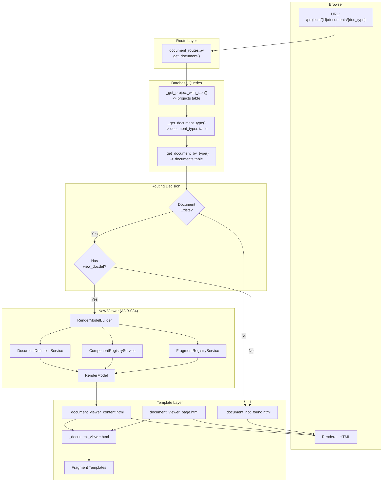
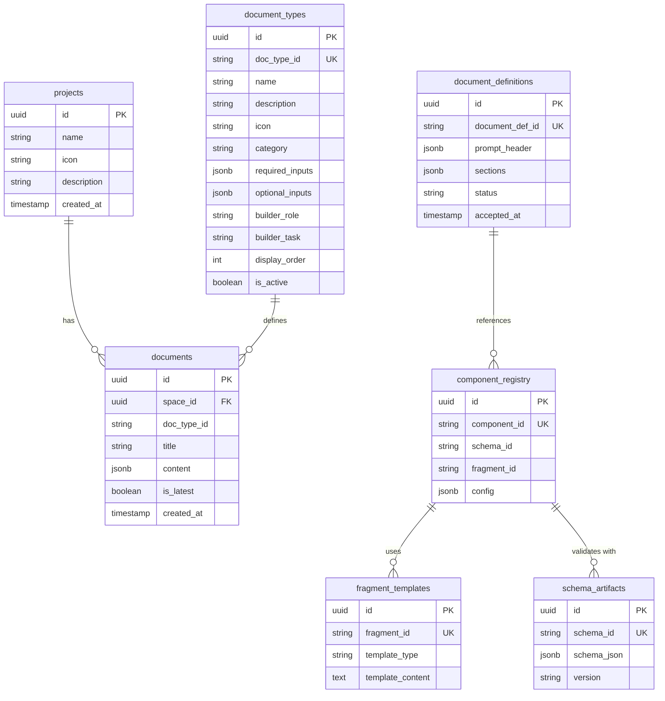
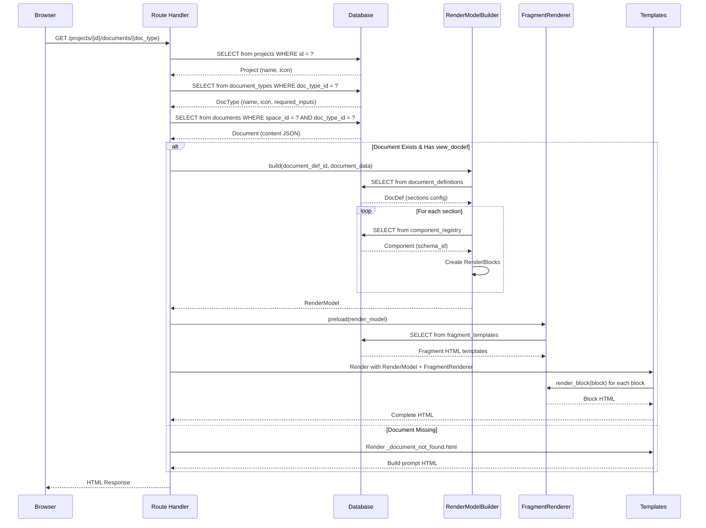
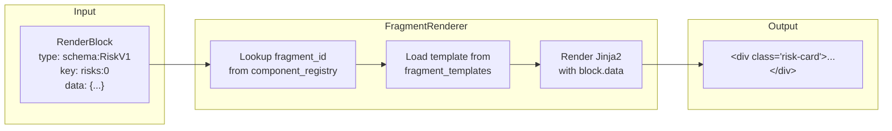
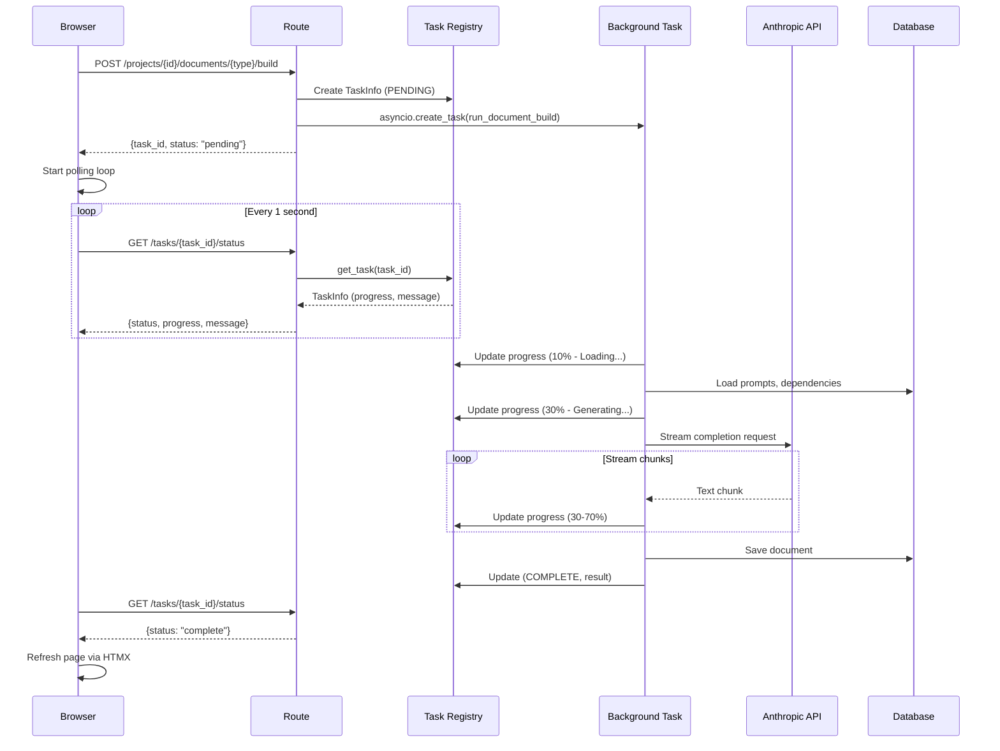

# Document Page Architecture

## Overview

This document describes the complete architecture for rendering document pages in The Combine. It covers the data flow from URL request to rendered HTML, including where each UI element (titles, icons, tabs, block content) originates.

---

## System Architecture Diagram



---

## Database Schema Relationships


---

## Request Flow Sequence



---

## UI Element Source Map

### Page-Level Elements

| UI Element | Source | Table/File | Field/Key |
|------------|--------|------------|-----------|
| **Page Title** (`<title>`) | RenderModel | Computed | `render_model.title` |
| **Header H1** | RenderModel | `documents.content` | `document_data.get("title")` or document_type name |
| **Header Subtitle** | RenderModel | Builder param | `render_model.subtitle` (optional) |
| **Document Type Badge** | RenderModel | Computed | `render_model.document_type` (e.g., "EpicBacklogView") |
| **Project Context** | Database | `projects` | `project.name`, `project.icon` |

### Document Type Configuration

| UI Element | Source | Table | Field |
|------------|--------|-------|-------|
| **Sidebar Icon** | Database | `document_types` | `icon` |
| **Sidebar Title** | Database | `document_types` | `name` |
| **Sidebar Description** | Database | `document_types` | `description` |
| **Required Dependencies** | Database | `document_types` | `required_inputs` (JSONB array) |
| **Display Order** | Database | `document_types` | `display_order` |

### Tab System

| UI Element | Source | Table | Field |
|------------|--------|-------|-------|
| **Tab Names** | Template Logic | `_document_viewer.html` | `tab_labels` dict |
| **Tab Assignment** | DocDef Sections | `document_definitions` | `sections[].viewer_tab` |
| **Tab Order** | Template Logic | `_document_viewer.html` | overview -> details -> alphabetical |

**Tab Labels Definition (in `_document_viewer.html`):**

```jinja2


```

### Section Elements

| UI Element | Source | Table | Field |
|------------|--------|-------|-------|
| **Section Title** | DocDef | `document_definitions` | `sections[].title` |
| **Section Description** | DocDef | `document_definitions` | `sections[].description` |
| **Section Order** | DocDef | `document_definitions` | `sections[].order` |
| **Section Tab** | DocDef | `document_definitions` | `sections[].viewer_tab` |

### Block Elements

| UI Element | Source | Table | Field |
|------------|--------|-------|-------|
| **Block Type** | Component | `component_registry` | `schema_id` |
| **Block Key** | Computed | RenderModelBuilder | `{section_id}:{index}` |
| **Block Data** | Document | `documents` | `content` (via JSON pointer) |
| **Block Context** | DocDef | `document_definitions` | `sections[].context` mapping |
| **Block HTML** | Fragment | `fragment_templates` | `template_content` |
---

## Document Definition Structure

A document definition (`document_definitions` table) controls how a document is rendered:

```json
{
  "document_def_id": "docdef:EpicBacklogView:1.0.0",
  "prompt_header": {
    "role": "architect",
    "constraints": ["..."]
  },
  "sections": [
    {
      "section_id": "summary",
      "title": "Project Summary",
      "order": 1,
      "viewer_tab": "overview",
      "component_id": "comp:ProjectSummaryV1",
      "shape": "single",
      "source_pointer": "/preliminary_summary"
    },
    {
      "section_id": "epics",
      "title": "Epics",
      "order": 2,
      "viewer_tab": "details",
      "component_id": "comp:EpicCardV1",
      "shape": "container",
      "repeat_over": "/epics",
      "source_pointer": "/",
      "context": {
        "epic_name": "/title",
        "epic_id": "/epic_id"
      },
      "detail_ref_template": {
        "document_type": "EpicDetailView",
        "params": {
          "epic_id": "/epic_id"
        }
      }
    },
    {
      "section_id": "risks",
      "title": "Identified Risks",
      "order": 3,
      "viewer_tab": "overview",
      "component_id": "comp:RiskItemV1",
      "shape": "list",
      "source_pointer": "/identified_risks"
    }
  ]
}
```

### Section Shape Semantics

| Shape | Description | Use Case |
|-------|-------------|----------|
| `single` | One block from a single JSON pointer | Summary sections, metadata |
| `list` | One block per array item | Risks, questions, simple lists |
| `nested_list` | Iterate parent, then child items | Stories within epics |
| `container` | One block per parent with grouped children | Epic cards with embedded stories |

---

## Template Hierarchy

```
Full Page Load (Browser Refresh)
+-- public/layout/base.html
    +-- public/pages/document_viewer_page.html
        +-- public/partials/_document_viewer.html
            +-- Fragment Templates (per block type)

HTMX Partial Load
+-- public/partials/_document_viewer_content.html
    +-- public/partials/_document_viewer.html
        +-- Fragment Templates (per block type)

Document Not Found
+-- public/pages/partials/_document_not_found.html
    +-- Build button with dependency checks
```

### Template Responsibilities

| Template | Responsibility |
|----------|----------------|
| `base.html` | Sidebar, navigation, global scripts, dark mode |
| `document_viewer_page.html` | Full page wrapper, extends base |
| `_document_viewer_content.html` | HTMX partial with header + content |
| `_document_viewer.html` | Tab system, section rendering, block iteration |
| `_document_not_found.html` | Build prompt, dependency display, polling UI |
| Fragment templates | Individual block rendering (cards, lists, etc.) |
---

## RenderModel Structure

The `RenderModel` is the central data structure passed to templates:

```python
@dataclass
class RenderModel:
    render_model_version: str      # "1.0"
    schema_id: str                 # "schema:RenderModelV1"
    schema_bundle_sha256: str      # Hash of all schemas used
    document_id: str               # Computed or from database
    document_type: str             # "EpicBacklogView"
    title: str                     # Display title
    subtitle: Optional[str]        # Optional subtitle
    sections: List[RenderSection]  # Ordered sections
    metadata: Dict[str, Any]       # section_count, etc.

@dataclass
class RenderSection:
    section_id: str                # Stable identifier
    title: str                     # Display title
    order: int                     # Sort order
    description: Optional[str]     # Optional description
    blocks: List[RenderBlock]      # Blocks in this section
    viewer_tab: str                # "overview", "details", etc.

@dataclass
class RenderBlock:
    type: str                      # "schema:OpenQuestionV1"
    key: str                       # "risks:0", "epics:1:stories:2"
    data: Dict[str, Any]           # Block data from document
    context: Optional[Dict]        # Parent context (epic_name, etc.)
```

---

## Icon Sources

Icons use Lucide icon names throughout the system:

| Location | Source | Example |
|----------|--------|---------|
| **Sidebar - Project** | `projects.icon` | `folder`, `rocket` |
| **Sidebar - Document** | `document_types.icon` | `compass`, `layers`, `building` |
| **Sidebar - Status** | Hardcoded in template | `file-check`, `file-plus`, `file-x`, `loader-2` |
| **Within Blocks** | Fragment templates | Varies by component |

### Status Icon Mapping (Sidebar)

| Status | Icon | Color |
|--------|------|-------|
| Generated (ready) | `file-check` | emerald-600 |
| Stale | `file-check` | amber-600 |
| Ready to build (waiting) | `file-plus` | violet-600 |
| Blocked (missing deps) | `file-x` | gray-400 |
| Generating | `loader-2` + animate-spin | violet-600 |

---

## Configuration Lookup Chain

When rendering a document, configuration comes from multiple sources with this priority:

### Document Type Name
1. `document_types.name` (database)
2. `DOCUMENT_CONFIG[doc_type_id]["title"]` (code fallback)
3. `doc_type_id.replace("_", " ").title()` (generated fallback)

### Document Type Icon
1. `document_types.icon` (database)
2. `DOCUMENT_CONFIG[doc_type_id]["icon"]` (code fallback)
3. `"file-text"` (default)

### View DocDef Selection
1. `DOCUMENT_CONFIG[doc_type_id]["view_docdef"]` (code)
2. Falls back to legacy template if not defined

### Document Title (Header)
1. `document.content["title"]` (from JSON)
2. `document_type` name (fallback)
---

## DOCUMENT_CONFIG Reference

Located in `document_routes.py`:

```python
DOCUMENT_CONFIG = {
    "project_discovery": {
        "title": "Project Discovery",
        "icon": "compass",
        "template": "public/pages/partials/_project_discovery_content.html",
        "view_docdef": "ProjectDiscoveryView",
    },
    "epic_backlog": {
        "title": "Epic Backlog",
        "icon": "layers",
        "template": "public/pages/partials/_epic_backlog_content.html",
        "view_docdef": "EpicBacklogView",
    },
    "technical_architecture": {
        "title": "Technical Architecture",
        "icon": "building",
        "template": "public/pages/partials/_technical_architecture_content.html",
        "view_docdef": "ArchitecturalSummaryView",
    },
    "story_backlog": {
        "title": "Story Backlog",
        "icon": "list-checks",
        "template": "public/pages/partials/_story_backlog_content.html",
        "view_docdef": "StoryBacklogView",
    },
}
```

---

## Fragment Rendering Flow



### Fragment Template Example

```html
{# Fragment: RiskItemV1 #}
<div class="risk-item p-4 rounded-lg border 
    border-red-300 bg-red-50
    border-amber-300 bg-amber-50
    border-gray-200 bg-gray-50">
    
    <div class="flex items-start gap-3">
        <span class="px-2 py-1 text-xs font-medium rounded
            bg-red-100 text-red-800
            bg-amber-100 text-amber-800
            bg-gray-100 text-gray-800">
            {{ data.likelihood | upper }}
        </span>
        <div>
            <p class="font-medium text-gray-900">{{ data.description }}</p>
            
            <p class="text-sm text-gray-600 mt-1">{{ data.impact_on_planning }}</p>
            
        </div>
    </div>
</div>
```
---

## Build Process (Document Generation)

When a document doesn't exist and the user clicks "Generate":



---

## Key Files Reference

| File | Purpose |
|------|---------|
| `app/web/routes/public/document_routes.py` | Route handlers, DOCUMENT_CONFIG |
| `app/domain/services/render_model_builder.py` | RenderModel construction |
| `app/api/services/document_definition_service.py` | DocDef CRUD |
| `app/api/services/component_registry_service.py` | Component lookups |
| `app/api/services/fragment_registry_service.py` | Fragment template loading |
| `app/web/routes/public/view_routes.py` | FragmentRenderer class |
| `app/web/templates/public/partials/_document_viewer.html` | Main viewer template |
| `app/web/templates/public/partials/_document_viewer_content.html` | HTMX partial wrapper |
| `app/web/templates/public/pages/document_viewer_page.html` | Full page wrapper |
| `app/web/templates/public/pages/partials/_document_not_found.html` | Build UI |
| `app/web/templates/public/components/project_list.html` | Sidebar document list |
| `app/tasks/document_builder.py` | Background build runner |
| `app/tasks/registry.py` | In-memory task tracking |

---

## Summary: Where Things Are Defined

| What | Where |
|------|-------|
| **Page title in browser tab** | `render_model.title` -> from `document.content["title"]` or document_type |
| **Header H1** | `render_model.title` |
| **Document type badge** | `render_model.document_type` (e.g., "EpicBacklogView") |
| **Tab names** | `_document_viewer.html` -> `tab_labels` dict |
| **Tab assignment per section** | `document_definitions.sections[].viewer_tab` |
| **Section titles** | `document_definitions.sections[].title` |
| **Block content** | `documents.content` via JSON pointer in docdef |
| **Block HTML rendering** | `fragment_templates.template_content` |
| **Sidebar doc icon** | `document_types.icon` |
| **Sidebar doc name** | `document_types.name` |
| **Sidebar status icon** | `project_list.html` (hardcoded per readiness status) |
| **Project icon** | `projects.icon` |
| **Required dependencies** | `document_types.required_inputs` |